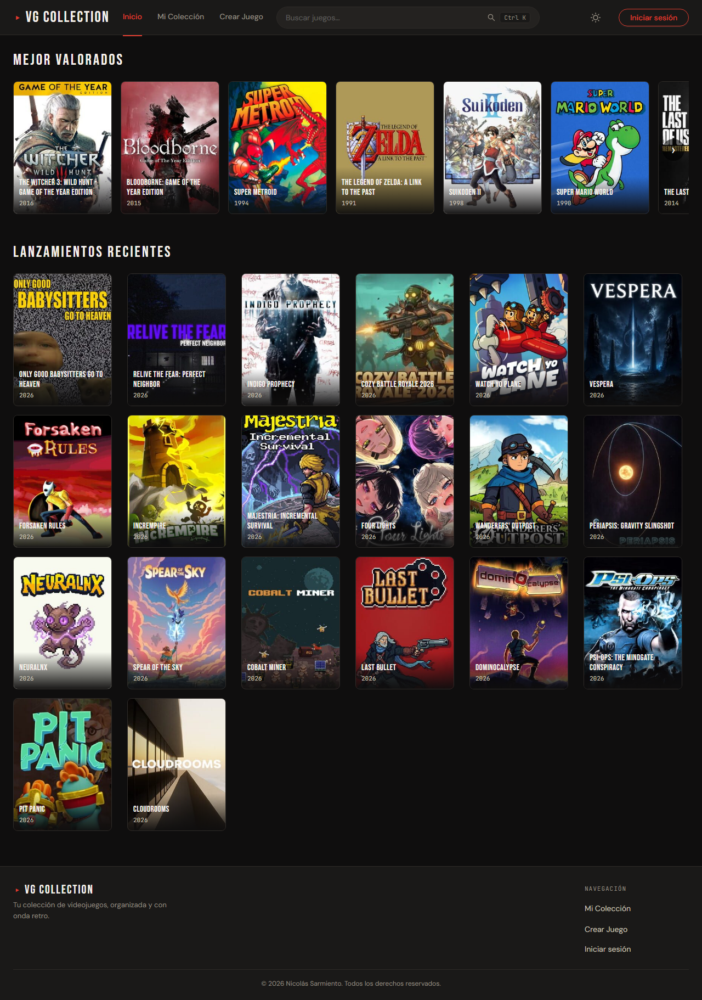
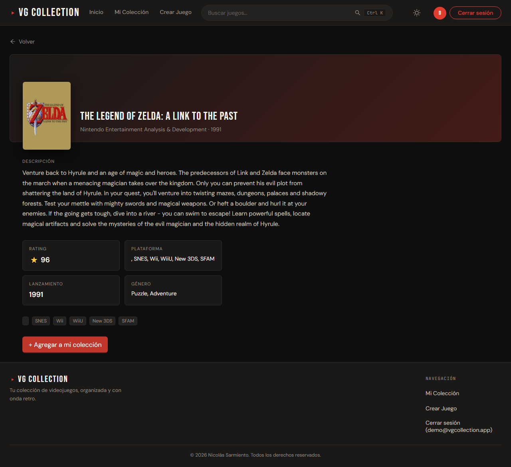
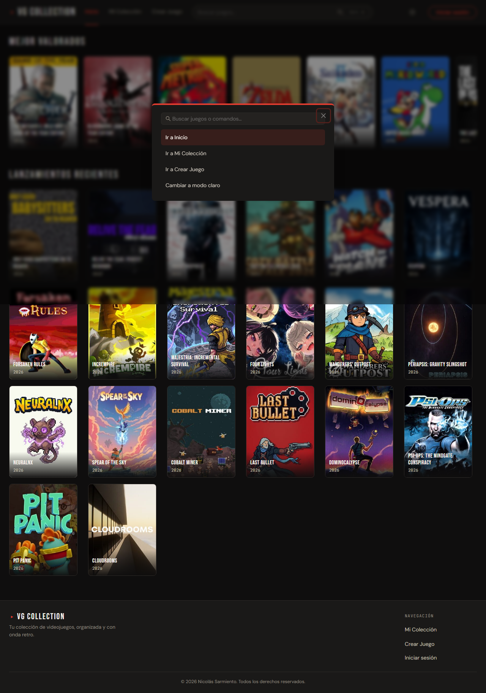
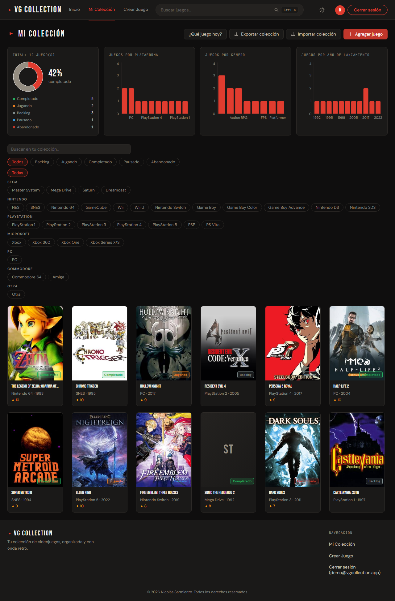
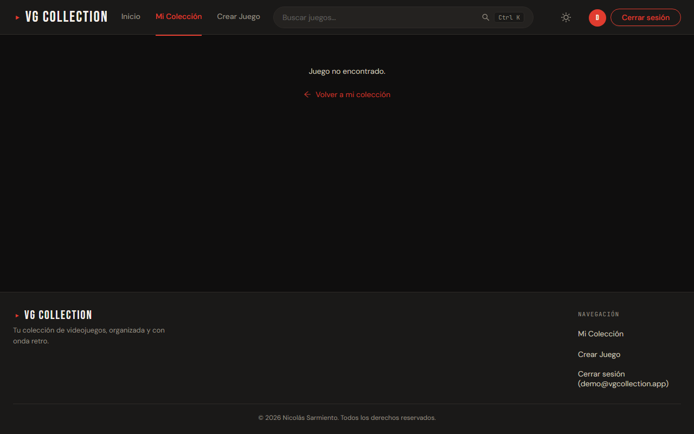
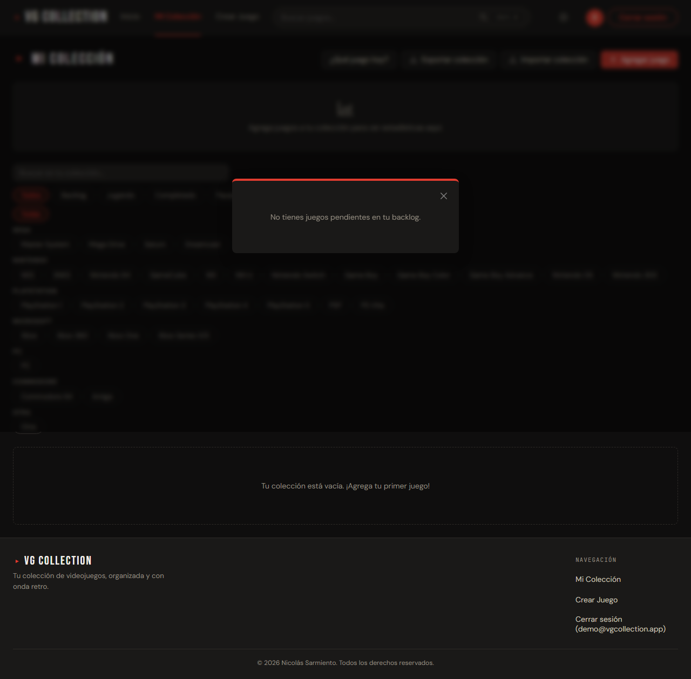
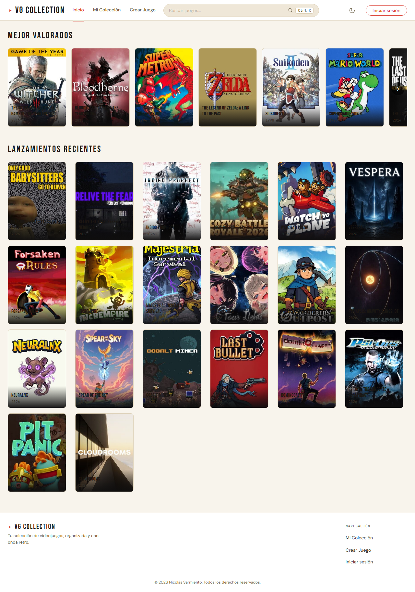
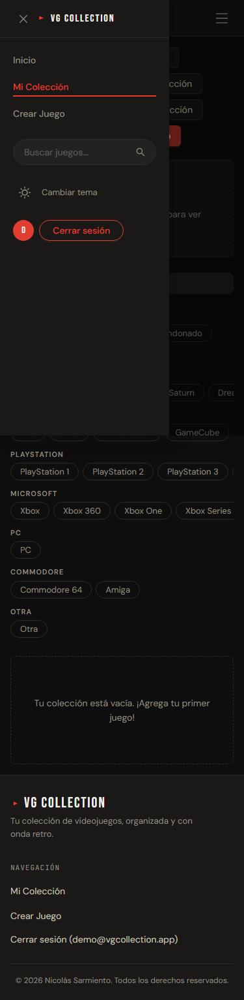

# VG Collection

**VG Collection** es una SPA en React para gestionar una colección personal de videojuegos. Se integra con la [API de IGDB](https://www.igdb.com/) para explorar el catálogo global, buscar títulos y enriquecer fichas con datos reales. Su identidad visual está inspirada en la estética retro-arcade, con tipografías Bebas Neue, DM Sans y JetBrains Mono, un acento rojo distintivo, dark mode por defecto y una paleta "Cream Arcade" propia para light mode.

<div align="center">
  
  <p><em>Página de inicio con carrusel de juegos mejor valorados y grilla de lanzamientos recientes desde IGDB.</em></p>
</div>

---

## Features

### Exploración y búsqueda

- **Home con datos de IGDB** — sección "Mejor Valorados" en carrusel horizontal y "Lanzamientos Recientes" en grilla, ambos con portadas, año, rating y plataformas.
- **Búsqueda global** — autocomplete en el header con resultados de IGDB, debounced a 400ms.
- **Command Palette** — presioná `Ctrl+K` (o `Cmd+K` en Mac) para buscar juegos, navegar entre secciones o cambiar el tema sin usar el mouse.
- **Detalle IGDB** — vista con banner hero, portada superpuesta, descripción, stats 2×2 (rating, plataforma, lanzamiento, género), tags de plataformas y botón para agregar a tu colección.

<div align="center">
  <table>
    <tr>
      <td width="50%"></td>
      <td width="50%"></td>
    </tr>
    <tr>
      <td><em>Detalle de juego desde IGDB con banner, stats y botón para agregar a colección.</em></td>
      <td><em>Command Palette con búsqueda de juegos y comandos de navegación.</em></td>
    </tr>
  </table>
</div>

### Mi colección

- **Colección personal** con filtros por estado (backlog, jugando, completado, pausado, abandonado), plataforma agrupada por fabricante (Nintendo, PlayStation, Sega, Microsoft, PC, Commodore) y búsqueda textual.
- **Alta de juegos** manual o desde el detalle de un título IGDB con datos precargados.
- **Dashboard de estadísticas** con gráficos Recharts: donut de completado, barras por plataforma, género y año de lanzamiento.
- **Importar/exportar** la colección completa como archivo JSON.
- **Opinión por juego** — puntos positivos, negativos, notas personales y marcado como completado con un solo clic.

<div align="center">
  <table>
    <tr>
      <td width="50%"></td>
      <td width="50%"></td>
    </tr>
    <tr>
      <td><em>Dashboard con donut de completado, barras por plataforma y desglose por estado.</em></td>
      <td><em>Detalle de juego en colección con opinión, notas y datos enriquecidos de IGDB.</em></td>
    </tr>
  </table>
</div>

### Productividad

- **¿Qué juego hoy?** — selección aleatoria del backlog con animación de "spinning" estilo ruleta. Ideal para when no sabés qué jugar.
- **Toggle dark/light mode** con paleta propia: dark arcade por defecto y "Cream Arcade" (beige cálido) para light mode.
- **Autenticación demo** en el cliente — sin backend real, pensada para prototipado y experiencia de usuario.

<div align="center">
  <table>
    <tr>
      <td width="50%"></td>
      <td width="50%"></td>
    </tr>
    <tr>
      <td><em>Modal "¿Qué juego hoy?" con selección aleatoria del backlog.</em></td>
      <td><em>Home en light mode con la paleta "Cream Arcade".</em></td>
    </tr>
  </table>
</div>

### Responsive design

<div align="center">
  
  <p><em>Vista mobile con menú de navegación tipo drawer y colección adaptada.</em></p>
</div>

---

## Stack

| Capa | Tecnología |
|---|---|
| **Framework** | React 19.2 + TypeScript 6 |
| **Build** | Vite 8 |
| **UI** | Ant Design 6.3 |
| **Routing** | React Router 7.14 |
| **Gráficos** | Recharts 3.9 |
| **Tests unitarios** | Vitest 4.1 + Testing Library |
| **Tests E2E** | Playwright 1.59 (7 viewports: 3 mobile, 2 tablet, 2 desktop) |
| **Backend** | Proxy serverless propio (`api/igdb/games.ts`) con rate limiting, sanitización de queries y cache de token Twitch |

---

## Arquitectura del proyecto

```
src/
├── features/           # Organización por dominio
│   ├── auth/           # Login/registro demo (cliente, sin backend)
│   ├── collection/     # Colección del usuario: dashboard, detalle, import/export, "Qué juego hoy"
│   ├── games/          # Formularios, detalle IGDB, reducer de estado global
│   ├── home/           # Página de inicio
│   └── popular/        # Hooks y UI de juegos IGDB (populares, recientes, búsqueda)
├── shared/
│   ├── constants/      # Valores fijos (estados de juego, colores)
│   ├── lib/            # Storage local con migración/validación
│   ├── state/          # Contextos globales (tema, command palette)
│   ├── types/          # Tipos TypeScript (Game, Platform, GameStatus, IgdbGame)
│   ├── ui/             # Layout, header search, footer, command palette, theme toggle
│   └── utils/          # Sanitización APICalypse, ratings, initials
api/
└── igdb/games.ts       # Proxy serverless a IGDB (producción en Vercel)
e2e/                    # Tests end-to-end con Playwright
```

### Flujo de datos IGDB

```
IGDB API (api.igdb.com)
      ↑ POST /games (APICalypse query)
      |
api/igdb/games.ts  ←  Vite proxy (dev) / Vercel serverless (prod)
      ↑ body sanitizado + rate limiting
      |
fetch('/api/igdb/games')  ←  useIgdbSearch, useIgdbPopularGames, etc.
      ↑ hooks de React
      |
Componentes de UI (PopularGameCard, GameDetailPage, CommandPalette, etc.)
```

---

## Cómo correrlo localmente

**Requisitos:** Node.js 20+, npm 9+

```bash
git clone <url-del-repo>
cd vg-collection
npm install
```

Crear un archivo `.env.local` en la raíz con credenciales de Twitch/IGDB:

```env
TWITCH_CLIENT_ID=tu_client_id
TWITCH_CLIENT_SECRET=tu_client_secret
```

Estas variables alimentan el proxy de Vite en desarrollo y el endpoint serverless (`api/igdb/games.ts`) en producción. Sin ellas, las secciones conectadas a IGDB mostrarán estados de error.

```bash
npm run dev          # → http://localhost:5173
```

### Comandos disponibles

| Comando | Descripción |
|---|---|
| `npm run dev` | Servidor de desarrollo con HMR |
| `npm run build` | Type-check + build de producción en `dist/` |
| `npm run preview` | Sirve el build de producción localmente |
| `npm run lint` | ESLint sobre todo el proyecto |
| `npm run test` | Tests unitarios (Vitest) en modo run |
| `npm run test:watch` | Tests unitarios en modo watch |
| `npm run test:e2e` | Tests E2E (Playwright) en 7 viewports |

---

## Testing

El proyecto combina dos capas de testing:

- **Unitarios e integración** con Vitest + Testing Library. Cubren reducers (`gamesReducer`), utilidades (`dashboardStats`, `randomPick`, `importExport`, `rating`, `apicalypse`), almacenamiento (`gamesStorage`) y flujos completos (`gamesFlow.integration.test`).
- **E2E** con Playwright sobre 7 viewports: iPhone SE, iPhone 14, Pixel 7, iPad Mini, iPad Pro 11", desktop 1280×800 y desktop 1920×1080. Cubren import/export de colección, command palette, responsive design y el flujo "Qué juego hoy".

```bash
npm run test          # Tests unitarios
npm run test:e2e      # Tests E2E (requiere npx playwright install primero)
```

---

## Deploy

Desplegado en [Vercel](https://vercel.com/) con:

- **Proxy serverless** en `api/igdb/games.ts` que intermedia requests a IGDB, valida formato y tamaño del body, sanitiza la query APICalypse y aplica rate limiting básico por IP.
- **Content-Security-Policy** estricta configurada via `vercel.json` (`default-src 'self'`, solo imágenes de `images.igdb.com`, nada de inline scripts).
- Headers de seguridad: `X-Content-Type-Options: nosniff`, `Referrer-Policy`, `X-Frame-Options: DENY`.

---

## Claude Code / Subagentes

El repositorio incluye un [`CLAUDE.md`](./CLAUDE.md) con contexto de arquitectura, convenciones y comandos para agentes de IA. También cuenta con subagentes especializados en `.claude/agents/`:

| Agente | Rol |
|---|---|
| **orchestrator** | Coordina tareas multi-dominio (UX, diseño, theming, seguridad) |
| **ux-ui-reviewer** | Revisa estados de carga, vacío, error y accesibilidad en componentes |
| **frontend-visual-designer** | Refuerza la identidad visual retro-arcade |
| **theme-color-specialist** | Mantiene coherencia dark/light y contraste de paleta |
| **security-auditor** | Audita proxy IGDB, auth demo y persistencia local antes de deploys |
